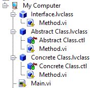

# LabVIEW-Color-Convention

Being a graphical language, colors allow a programmer to tell a story.. visually. 
That being said, an abundance of colors, although telling a story, can be difficult to follow. 
Taking inspiration from [Dmitry Sagatelyan](https://forums.ni.com/t5/LabVIEW-Champions-Directory/LabVIEW-Champion-Dmitry-Sagatelyan/ta-p/3536802) and his presentations over the years.. I have adopted a color scheme that resembles his presenation color way for separating the following three objects:
- Interface
- Abstract Class
- Concrete Class

The following presentations show the colors via `Legend` markers in his slides
> [7 x 7 Minute Presentations - Hosted by Fabiola
](https://www.youtube.com/watch?v=buVvpzs0IoQ&list=PLvDxiIkwuMQsbDa7zGxcczwc-QYXY2huD&index=6) and 
> [GLA Summit 2022: Context-Agnostic Actors - The Holy Grail of Distributed Application Development
](https://www.youtube.com/watch?v=XjUKgLtANhM&list=PLvDxiIkwuMQsbDa7zGxcczwc-QYXY2huD&index=8)

*Note: To clear up a misconception: Dmitry does not use these color patterns in his LabVIEW code.. rather, this is just an idea I had for the color scheme I would use in **my** LabVIEW code. The inspiration was gained by watching his recorded presenations above*

*Note: Any generated messages, such as those created using Actor Framework via scripting are **NOT** changed to the colors here. Their  API is left untouched*

### Wire Appearance

\

# Justification

It is since to see just three colors when using a class. In particular, in the ideal world, we'll be using a plugin architecture. This means that we'll be using the *Dependency Inversion Principle (D in SOLID)* so that only objects composed in our class of interest will be:
1. Abstract Classes and
2. Interfaces 
Therefore, when changing the source code for a class (which is a blue color wire), the only blue color wire will be the class. Otherwise, any other object that is used will be teal (abstract class) or grenn (interface). It should be immediately clear that you are ***NOT*** following the Dependency Inversion Principle if there are multiple blue wires belonging to different classes.. within your class you're editing.
